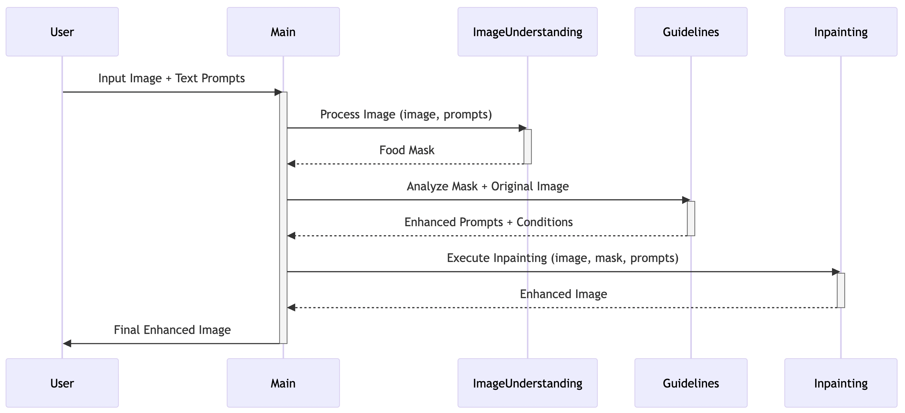

# Food Image Enhancement Tool

A tool to enhance food images by detecting food items, adjusting composition, and inpainting backgrounds using AI models.

## Features

- **Food Object Detection**: Uses `LangSAM` for segmentation and mask generation.
- **Composition Validation**: Ensures 5:4 aspect ratio and rule of thirds alignment.
- **Background Inpainting**: Replaces backgrounds using Stable Diffusion or Yahoo's custom model.
- **GPU Acceleration**: Optimized for CUDA-enabled devices.

---

## Data Flow



---

## Installation

### Prerequisites

- Python 3.11+ (for langsam)
- [PyTorch](https://pytorch.org/) (with CUDA if available)
- Hugging Face Account (for model access)

### Steps

1. **Set up a virtual environment**:

   ```bash
   python -m venv venv
   source venv/bin/activate
   pip install -r requirements.txt
   ```


2. **Authenticate with Hugging Face** (for Yahoo model access):
   - Create a [Hugging Face token](https://huggingface.co/settings/tokens).
   - Run:
     ```bash
     huggingface-cli login
     ```
   - Enter your token when prompted.

---

## Repository Structure

```
food-image-enhancement/
├── README.md               # Project documentation
└── src/
    ├── __init__.py         # Package initialization
    ├── main.py             # Entry point for processing
    ├── image_understanding.py # Food detection and masking
    ├── guidlines_generation.py # Composition adjustment
    ├── inpainting.py       # Background inpainting pipelines
    └── utils.py            # Helper functions
```

---

## Usage

### Command Line

```bash
python src/main.py \
  --input [INPUT_DIR] \
  --output [OUTPUT_DIR] \
  --experiment [EXPERIMENT_NAME]
```

Example:

```bash
python src/main.py \
  --input ./raw_images \
  --output ./results \
  --experiment test_run
```

### Customizing the Prompt

Modify the `prompt` variable in `main.py` to control background generation. Default:

```python
prompt = "the dish is placed on a circular white plate. the plate is placed on a wooden table. Clean table"
```

---

## Configuration

### `CompositionValidator` Parameters (in `guidlines_generation.py`)

- `max_width=1000`: Maximum width of the output image.
- `max_coverage=0.6`: Maximum allowed food area coverage (avoids over-cropping).
- `rule_threshold=0.15`: Tolerance for rule-of-thirds alignment.

### Model Selection

In `main.py`, choose between:

- Stability AI: `"stabilityai/stable-diffusion-2-inpainting"`
- Yahoo: `"yahoo-inc/photo-background-generation"` (requires authentication)

---

## Troubleshooting

1. **CUDA Out of Memory**:

   - Reduce image input size.
   - Close other GPU-intensive applications.

2. **Hugging Face Model Access Denied**:

   - Ensure your token has access to `yahoo-inc/photo-background-generation`.
   - Re-run `huggingface-cli login`.

3. **Slow Performance**:
   - Use smaller images (e.g., 800x600px).
   - Switch to CPU mode by modifying `device="cpu"` in `image_understanding.py`.

---

## License

Apache 2.0 (Check model licenses separately).
